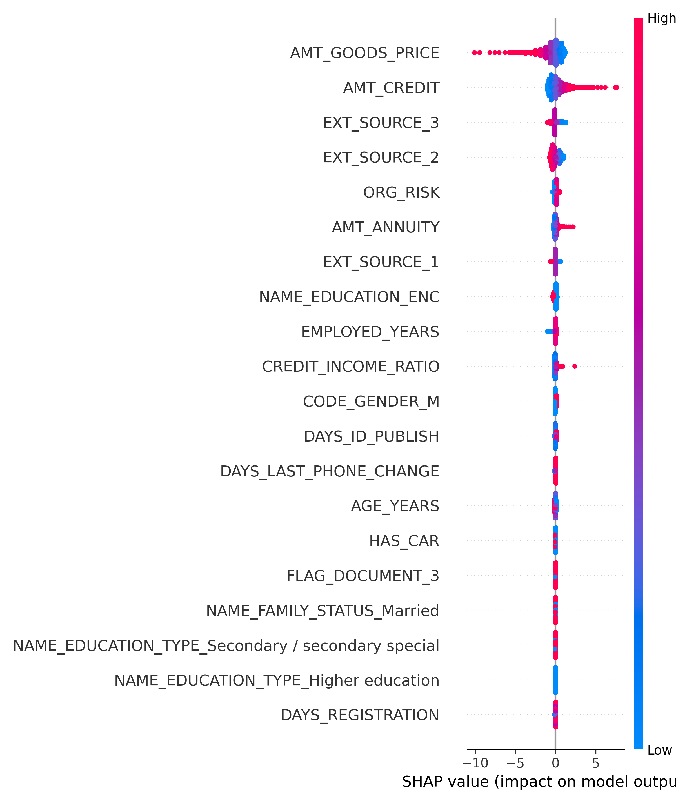
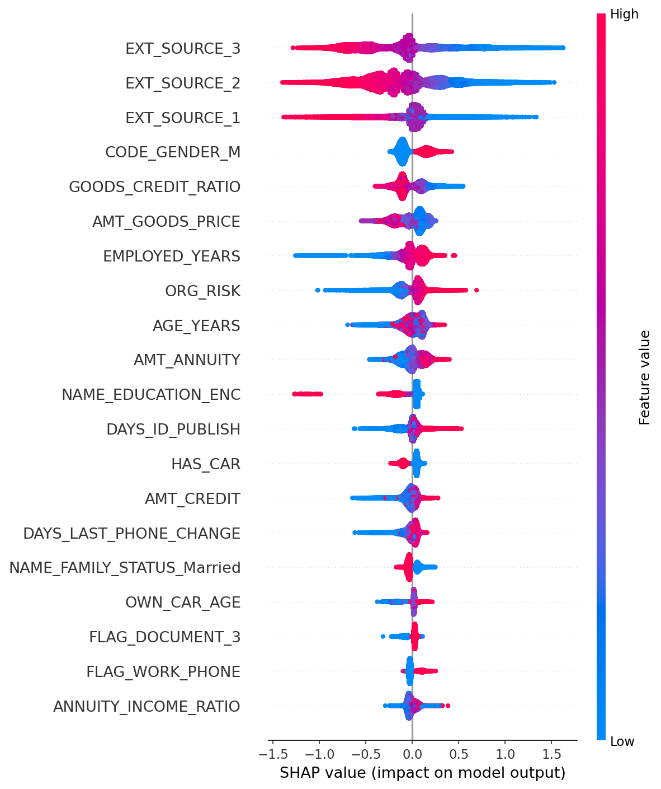
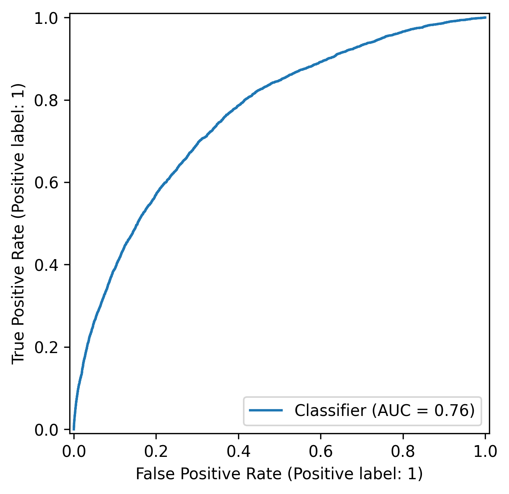
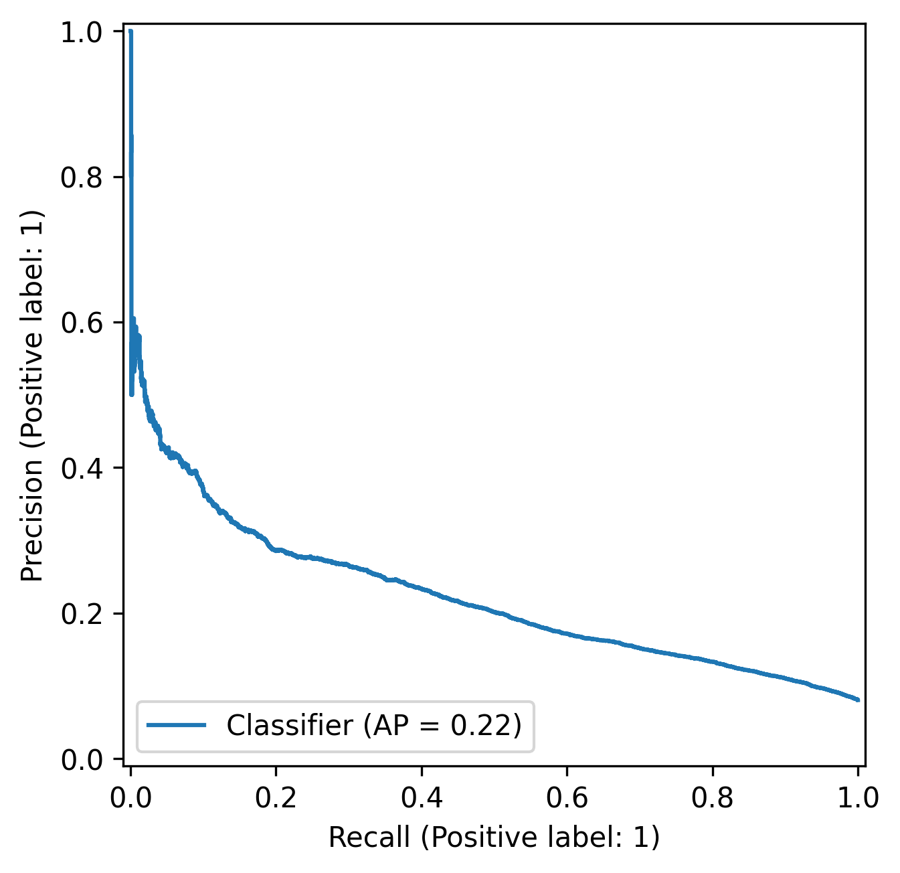
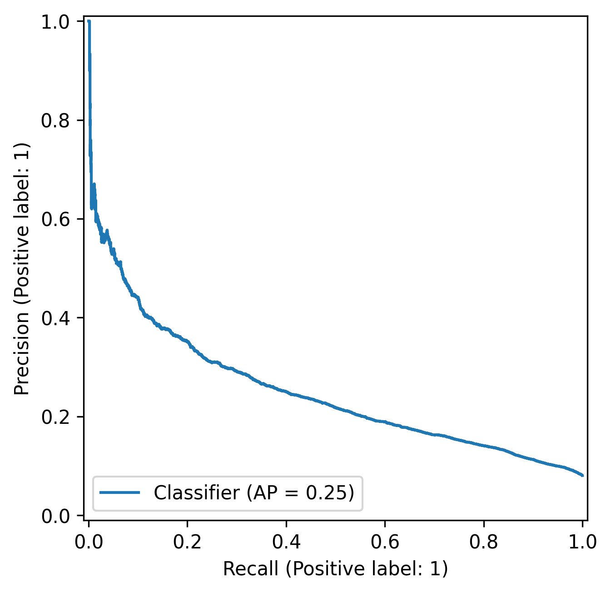
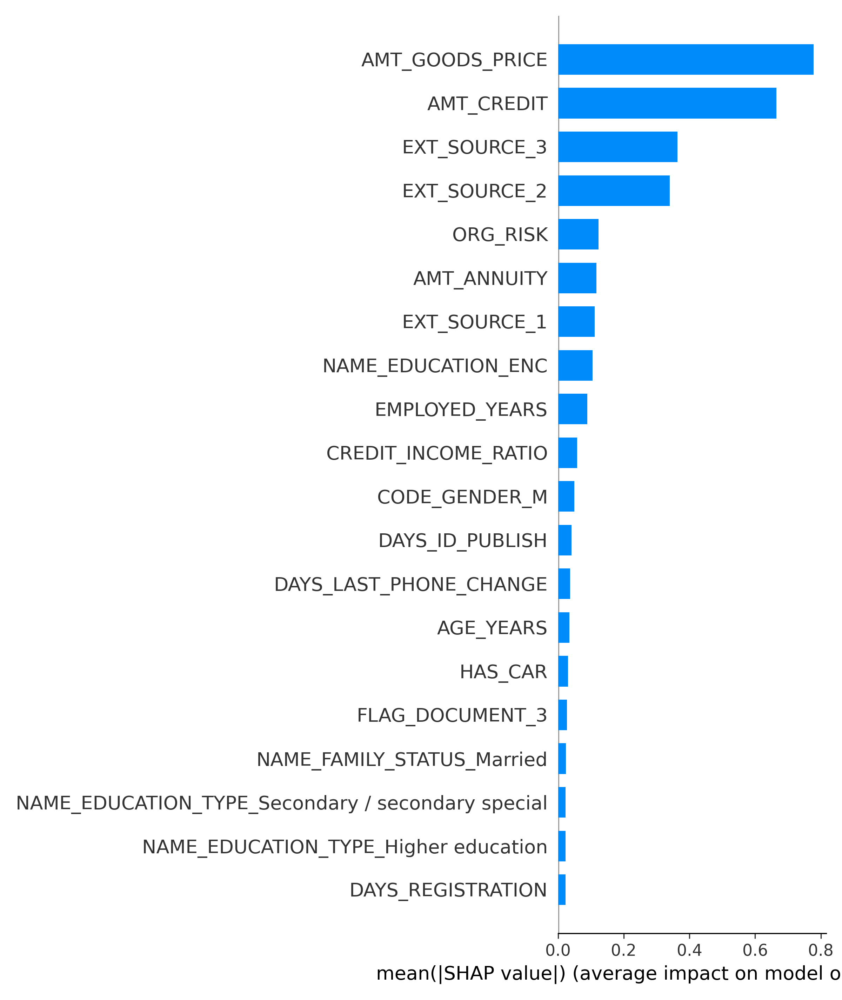
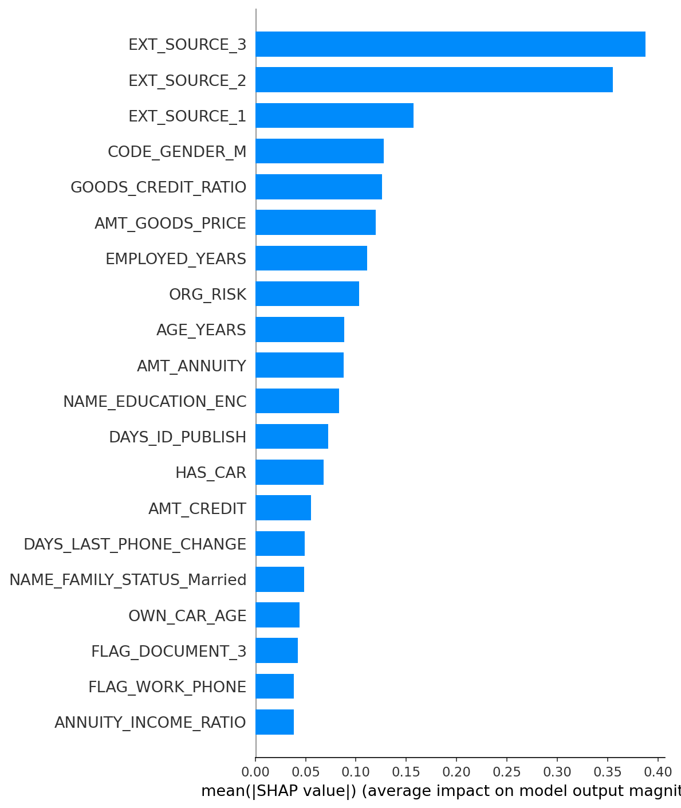

# Credit Risk Modeling with Probability Calibration, Risk Bucketing, and SHAP Explainability

## Project Overview
This project demonstrates an end-to-end Credit Risk Pipeline that moves beyond simple classification. It focuses on producing well-calibrated probabilities of default (PD) and translating them into actionable business risk buckets

Rather than optimizing for accuracy alone, the project emphasizes **risk ranking, uncertainty awareness, and explainability**, 
closely mirroring how credit risk models are used in real financial institutions.

---

## Key Highlights

- Calibration: Reduced ECE from 0.346 → 0.001 across both Logistic Regression and XGBoost using Platt Scaling — a 99.7% improvement in probability reliability.
- Decisioning: Developed a 4-tier Risk Bucketing framework (Low to Very High) to automate lending decisions.
- Explainability: Integrated SHAP to provide "Reason Codes" for loan denials, satisfying regulatory transparency requirements.

---

## Key Results

### ROC Curve 


### Global SHAP Feature Importance



---

## Dataset
- **Source:** [Home Credit Default Risk Dataset – Kaggle](https://www.kaggle.com/c/home-credit-default-risk)
- Raw dataset is not included in this repository due to size constraints.
- **Target:** `TARGET` (1 = default, 0 = non-default)
- **Data type:** Structured tabular data (numerical + categorical)
- **Challenges:**
  - Class imbalance
  - Missing values
  - High-cardinality categorical features
  - Regulatory need for explainability

---

## Project Structure
credit-risk-ml/
│
├── data/
│ ├── raw/
│ └── processed/
│
├── notebooks/
│ ├── 01_eda.ipynb
│ ├── 02_feature_engineering.ipynb
│ ├── 03_modeling_baseline.ipynb
│ ├── 04_uncertainty_calibration.ipynb
│ ├── 05_business_decisions.ipynb
│ ├── 06_explainability_shap.ipynb
│ └── 07_xgb_modeling.ipynb
│
├── src/
│ ├── data_prep.py
│ ├── features.py
│ ├── train.py
│ ├── evaluate.py
│ ├── uncertainty.py
│ └── explainability.py
│
├── models/
│ ├── logreg_baseline.joblib
│ ├── logreg_platt.joblib
│ ├── xgb_model.joblib
│ ├── xgb_calibrated.joblib
│ └──  preprocessor_fit.joblib
│
├── reports/
│ └── figures/
| └── summary_tables
│
└── README.md
└── requirements.txt


---

## Modeling Approach

### Models
- Logistic Regression (baseline, class-weighted to handle imbalance)
- XGBoost (final model for improved non-linear learning and ranking performance)

### Evaluation Metrics
- ROC-AUC (risk ranking)
- Precision / Recall
- Expected Calibration Error (ECE)
- Brier Score

### Probability Calibration
- Applied **Platt** Scaling and **Isotonic** Regression to Logistic Regression to align predicted probabilities with observed default rates.
- Evaluated using reliability curves , Expected Calibration Error (ECE) and Brier Score
- Platt Scaling provided near-zero ECE and improved probability alignment without degrading AUC. 
- Applied sigmoid calibration with 5-fold CV to XGBoost, which improved probability alignment (↓ ECE , ↓ Brier Score) without degrading AUC.

## Model Performance Summary

| Metric | Logistic Regression | Logistic Regression Calibrated (Platt) | XGBoost | XGBoost Calibrated |
|--------|-------------------|--------------------|--------------------|--------------------|
| ROC-AUC | 0.743 | 0.743 | 0.760 | 0.763 |
| Brier Score | 0.204 | 0.068 | 0.149 | 0.067|
| ECE | 0.346 | 0.001 | 0.252 | 0.001|

Calibration dramatically improved probability reliability (ECE 0.252 → 0.001) without degrading discrimination (AUC 0.760 → 0.763), confirming XGBoost Calibrated as the superior model for production lending decisions.

### ROC Curve (Baseline)




### Precision-Recall Curve (Baseline)




---

## Business Logic: Risk Bucketing

Predictions are mapped to specific lending actions. This allows the business to automate low-risk loans while flagging high-risk cases for manual review.

| Risk Bucket | PD Range | Decision |
|------------|---------|----------|
| Low        | < 5%     | Auto-approve |
| Medium     | 5–16%    | Approve with conditions |
| High       | 16–45%   | Manual review |
| Very High  | > 45%    | Reject |

---

## Business Decisions
The project illustrates how model outputs directly influence lending decisions and portfolio performance. It demonstrates:
- How approval thresholds determine portfolio risk exposure
- The trade-off between growth (approval rate) and credit losses (default rate)
- Why applicants with seemingly reasonable profiles may still fall below risk tolerance
- How explainability increases stakeholder trust in automated underwriting
- How model-driven decisions align with institutional risk appetite

---

## Explainability (SHAP)

### Global Feature Importance



SHAP (SHapley Additive exPlanations) is used to:
- Identify global drivers of default risk
- Explain individual applicant decisions
- Support transparency and regulatory compliance

Key outputs:
- Global feature importance (mean absolute SHAP)
- Individual applicant explanations
- Quantification of each feature’s contribution to individual PD
- Consistency between SHAP risk drivers and domain expectations
- Auditable explanation layer for regulatory transparency

---

### Example: High-Risk Applicant Explanation

Predicted Probability of Default (PD): 0.407
Risk Bucket: High → Manual Review
Actual Outcome: Default ✓ (model correct)

Top risk-increasing drivers:
- High debt-to-credit ratio (DS_CREDIT_RATIO)
- Low external credit scores (EXT_SOURCE_2, EXT_SOURCE_3)
- Applicant registered in different city than residence
- High-risk organisation type (ORG_RISK — engineered feature)

Top risk-reducing drivers:
- Document verification days (DAYS_ID_PUBLISH)
- Goods price (AMT_GOODS_PRICE)

---

## Key Takeaways
- Calibration is critical when probabilities drive decisions
- Risk ranking matters more than raw accuracy
- Explainability is essential for regulated domains
- Business logic must be explicitly defined, not implied

---

## Future Improvements
- Monotonic constraints on XGBoost for regulatory compliance
- Cost-sensitive optimization
- Reject inference
- Temporal validation
- Policy stress testing

---

## Author
Built as a portfolio project to demonstrate **end-to-end applied data science**, bridging modeling, uncertainty, and business decision-making.

---

## What This Project Demonstrates

- Risk modeling beyond accuracy (ranking + calibration)
- Business-aligned threshold optimization
- Probability calibration for financial reliability
- Model transparency using SHAP for interpretability
- Translation of predictions into actionable credit policy

---

## Setup
```bash
pip install -r requirements.txt
```