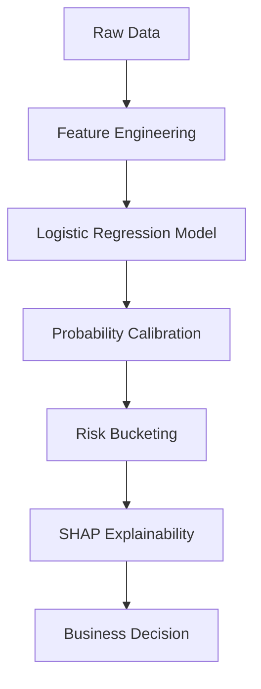
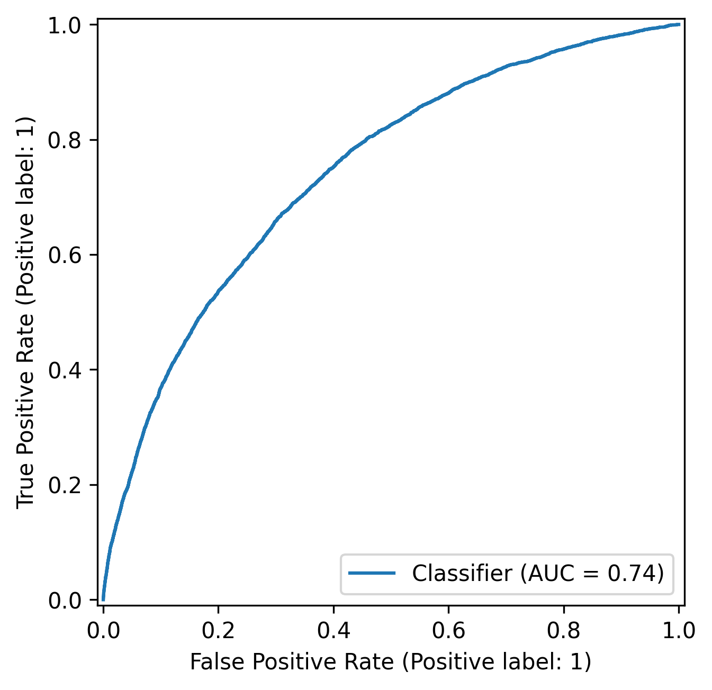
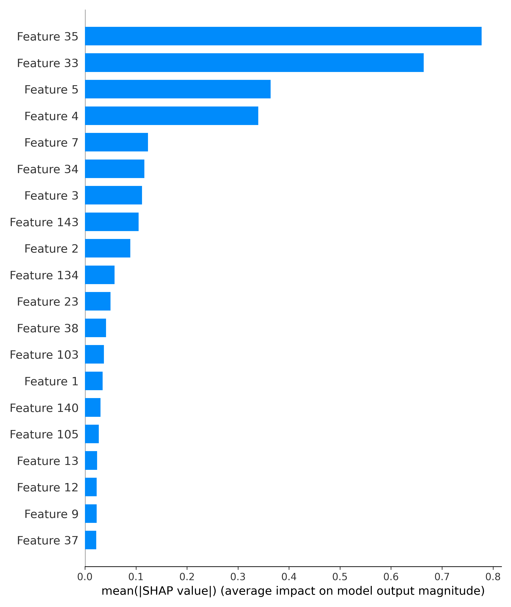
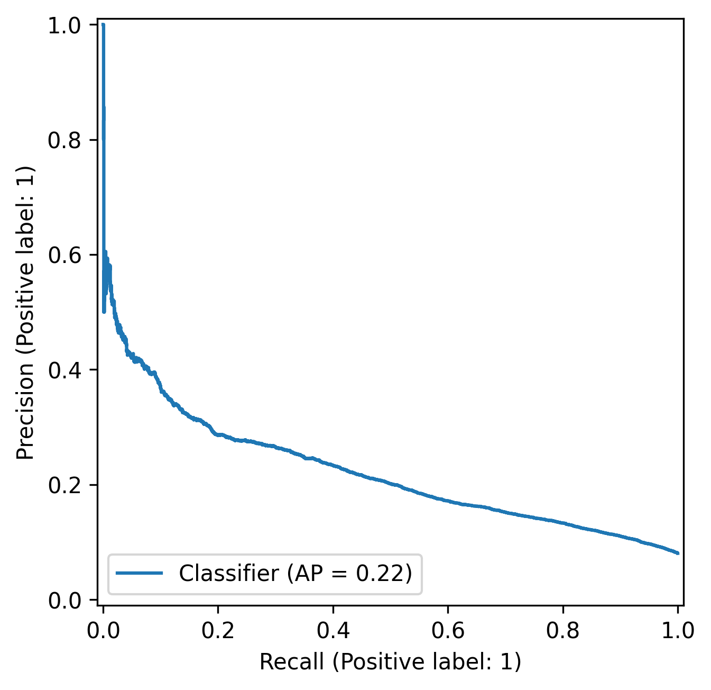
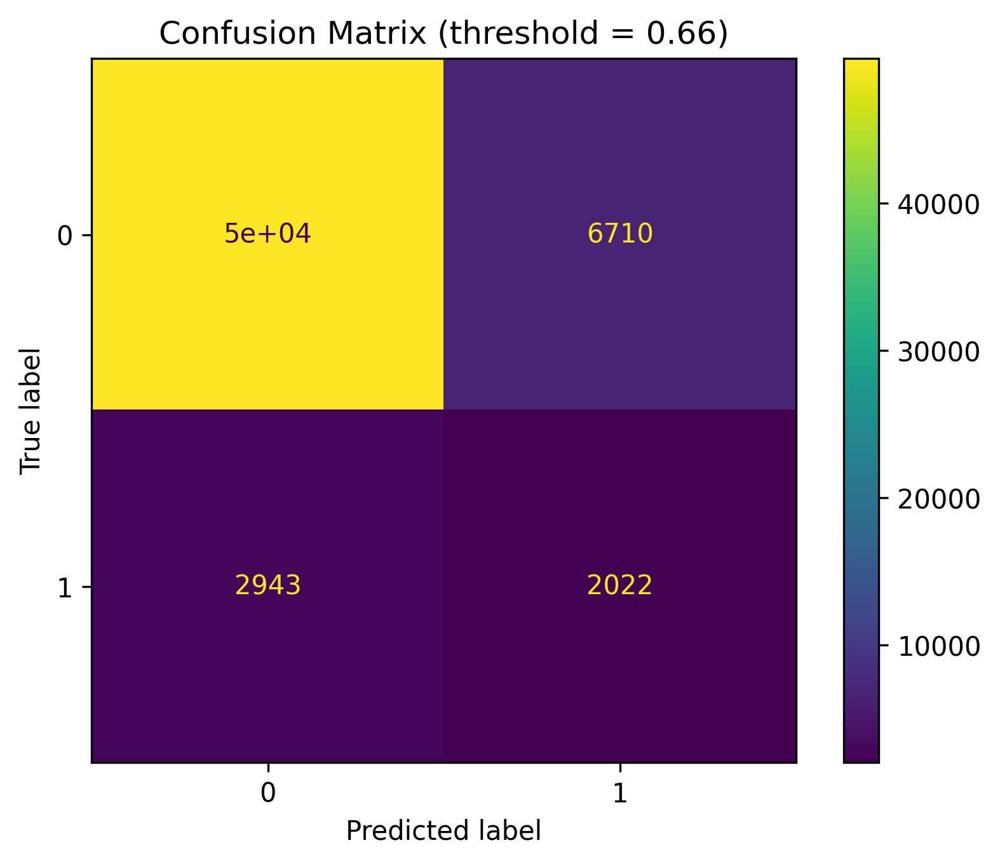

# Credit Risk Modeling with Probability Calibration, Risk Bucketing, and SHAP Explainability

## Project Overview
This project builds an end-to-end **credit risk modeling pipeline** focused on:
- Predicting probability of default (PD)
- Calibrating model probabilities
- Translating predictions into business decisions
- Explaining decisions using SHAP

Rather than optimizing for accuracy alone, the project emphasizes **risk ranking, uncertainty awareness, and explainability**, 
closely mirroring how credit risk models are used in real financial institutions.

---

## Modeling Pipeline


---

## Tech Stack

- Python
- Scikit-learn
- Pandas
- NumPy
- SHAP
- Matplotlib / Seaborn

---

## Key Results
### ROC Curve


### Global SHAP Feature Importance


The model achieves moderate risk-ranking ability while maintaining calibrated probability estimates suitable for credit decision-making.
---

## Dataset
- **Source:** [Home Credit Default Risk Dataset – Kaggle](https://www.kaggle.com/c/home-credit-default-risk)
- **Target:** `TARGET` (1 = default, 0 = non-default)
- **Data type:** Structured tabular data (numerical + categorical)
- Dataset size:
    - ~307k training records
    - ~122 features
    - default rate ≈ 8%

The raw dataset is not included in this repository due to size constraints.

To reproduce the project:

1. Download the dataset from Kaggle
2. Place the files in `data/raw/`
3. Run the feature engineering pipeline in `notebooks/02_feature_engineering.ipynb`

Processed feature files are generated during the feature engineering stage and are not stored in the repository.

**Challenges:**
- Class imbalance
- Missing values
- High-cardinality categorical features
- Regulatory need for explainability

---

## Problem Statement
Given applicant-level financial and demographic data, predict the probability that a loan applicant will default and translate that risk into actionable credit decisions.

Key objectives:
- Produce **well-calibrated probabilities**, not just class labels
- Rank applicants by risk
- Create interpretable risk buckets
- Justify decisions using model explainability

---

## Project Structure
```
credit-risk-modeling/
│
├── README.md      
├── requirements.txt       
│
├── notebooks/      
│   ├── 01_eda.ipynb
│   ├── 02_feature_engineering.ipynb
│   ├── 03_modeling_baseline.ipynb
│   ├── 04_uncertainty_calibration.ipynb
│   ├── 05_business_decisions.ipynb
│   └── 06_explainability_shap.ipynb
│
├── src/    
│   ├── data_prep.py
│   ├── features.py
│   ├── train.py
│   ├── evaluate.py
│   ├── uncertainty.py
│   └── explainability.py
│
├── reports/      
│   ├── figures/
│   └── summary_tables/
│
├── models/     
│
└── data/      
    ├── raw/
    └── processed/
```
Some intermediate artifacts (e.g., test data objects and processed feature files) are not stored in the repository due to size constraints. These can be regenerated by running the preprocessing and training pipeline.
---

## Modeling Approach

### Baseline Model
- Logistic Regression
- Class-weighted to handle imbalance
- Pipeline with preprocessing

### Evaluation Metrics
- ROC-AUC (risk ranking)
- Precision / Recall
- Confusion Matrix
- Probability distributions

---

## Model Performance Summary

| Metric | Baseline Logistic | Calibrated (Platt) |
|--------|-------------------|--------------------|
| ROC-AUC | 0.74 | 0.74 |
| Brier Score | 0.198 | 0.182 |
| ECE | 0.041 | 0.004 |

The baseline logistic regression achieved an ROC-AUC of 0.74, indicating moderate
risk-ranking ability.
### ROC Curve (Baseline)

### Precision-Recall Curve (Baseline)


Calibration reduced Brier Score and ECE while ROC-AUC remained unchanged.

---

## Probability Calibration
To ensure predicted probabilities reflect real-world default rates:
- **Platt Scaling**
- **Isotonic Regression**

Platt Scaling was selected after comparing calibration methods using:
- Reliability curves
- Expected Calibration Error (ECE)
- Brier Score

Platt Scaling provided near-zero ECE and improved probability alignment without degrading AUC.
Calibration improved probability reliability without degrading discrimination (AUC remained stable).

---

## Threshold Analysis

Before defining risk buckets, the model's performance across probability thresholds was analyzed to understand trade-offs between approval rate,
false positives, and missed defaults.



This analysis illustrates how decision thresholds influence portfolio risk
and approval rates. However, rather than relying on a single cutoff, the
final decision framework uses multiple risk buckets aligned with lending policy.

---

## Risk Bucketing & Decisions
Predicted PDs are converted into risk buckets aligned with business policy:

| Risk Bucket | PD Range | Decision |
|------------|---------|----------|
| Low        | < 5%     | Auto-approve |
| Medium     | 5–16%    | Approve with conditions |
| High       | 16–45%   | Manual review |
| Very High  | > 45%    | Reject |

This allows graded decision-making rather than binary classification.

---

## Business Decisions
The project illustrates how model outputs directly influence lending decisions and portfolio performance. It demonstrates:
- How approval thresholds determine portfolio risk exposure
- The trade-off between growth (approval rate) and credit losses (default rate)
- Why applicants with seemingly reasonable profiles may still fall below risk tolerance
- How explainability increases stakeholder trust in automated underwriting
- How model-driven decisions align with institutional risk appetite

---

## Explainability with SHAP

### Global Feature Importance


SHAP (SHapley Additive exPlanations) is used to interpret model predictions and
identify the primary drivers of default risk.

It enables:
- Global interpretation of model behavior
- Case-level explanations for individual applicants
- Transparency for decision-making in regulated domains

Key outputs include:
- Global feature importance (mean absolute SHAP values)
- Individual applicant explanations
- Quantification of each feature’s contribution to predicted PD
  
### Example: High-Risk Applicant Explanation

**Predicted Probability of Default (PD):** 0.72  
**Risk Bucket:** Very High → Reject

Top risk-increasing drivers:
- Low income
- Short employment history
- High external risk score
- Previous late payments

Top risk-reducing drivers:
- Age
- Stable organization type

Despite some stabilizing factors, the combined impact of financial risk indicators leads to a very high predicted probability of default, resulting in rejection according to the defined lending policy.

---

## Key Takeaways
- Calibration is critical when probabilities drive decisions
- Risk ranking matters more than raw accuracy
- Explainability is essential for regulated domains
- Business logic must be explicitly defined, not implied

---

## Future Improvements
- Tree-based models (GBM / XGBoost) with monotonic constraints
- Cost-sensitive optimization
- Reject inference
- Temporal validation
- Policy stress testing

---

## How to Run

1. Install dependencies

pip install -r requirements.txt

2. Download dataset from Kaggle

https://www.kaggle.com/c/home-credit-default-risk

3. Place files in:

data/raw/

4. Run the notebooks

---

## Author

Pratik

This project was built to demonstrate applied data science workflows in risk modeling,
including probability calibration, threshold optimization, and explainable machine learning.

Focus areas:
- probabilistic modeling
- decision-oriented ML
- interpretable models for regulated domains

---

## What This Project Demonstrates

- Risk modeling beyond accuracy (ranking + calibration)
- Business-aligned threshold optimization
- Probability calibration for financial reliability
- Model transparency using SHAP for interpretability
- Translation of predictions into actionable credit policy

---

## Setup
```bash
pip install -r requirements.txt

```


