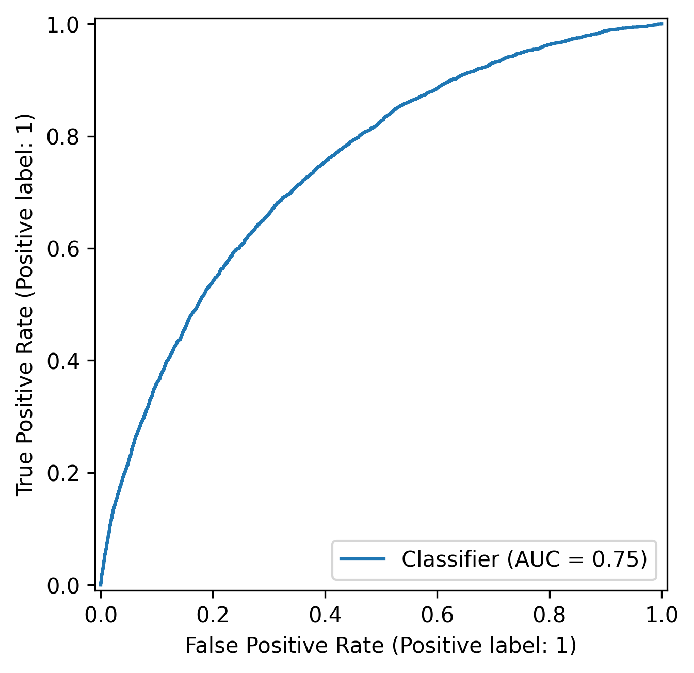
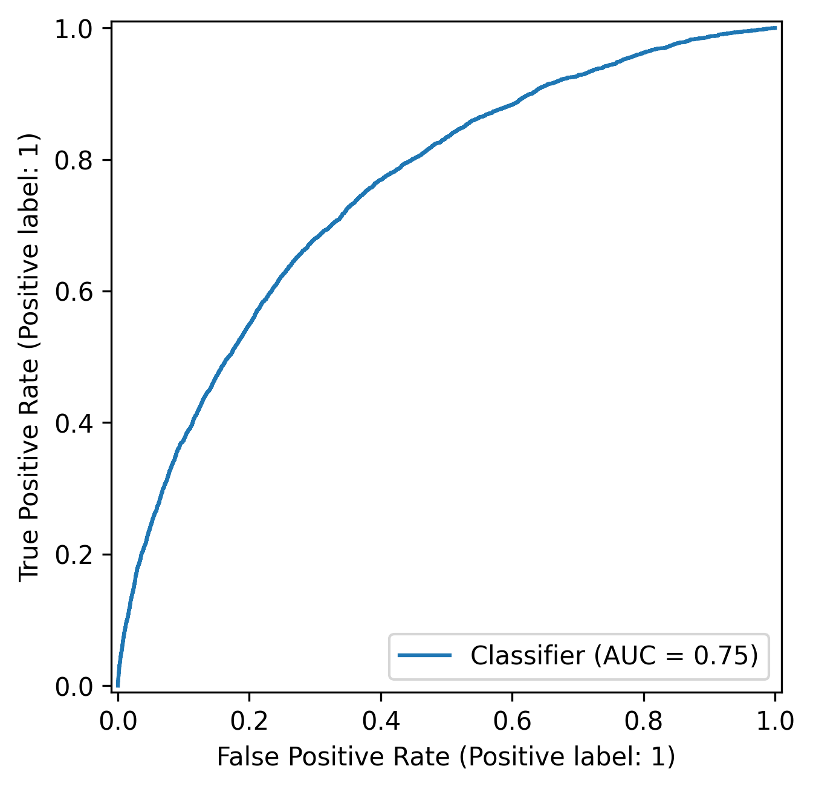
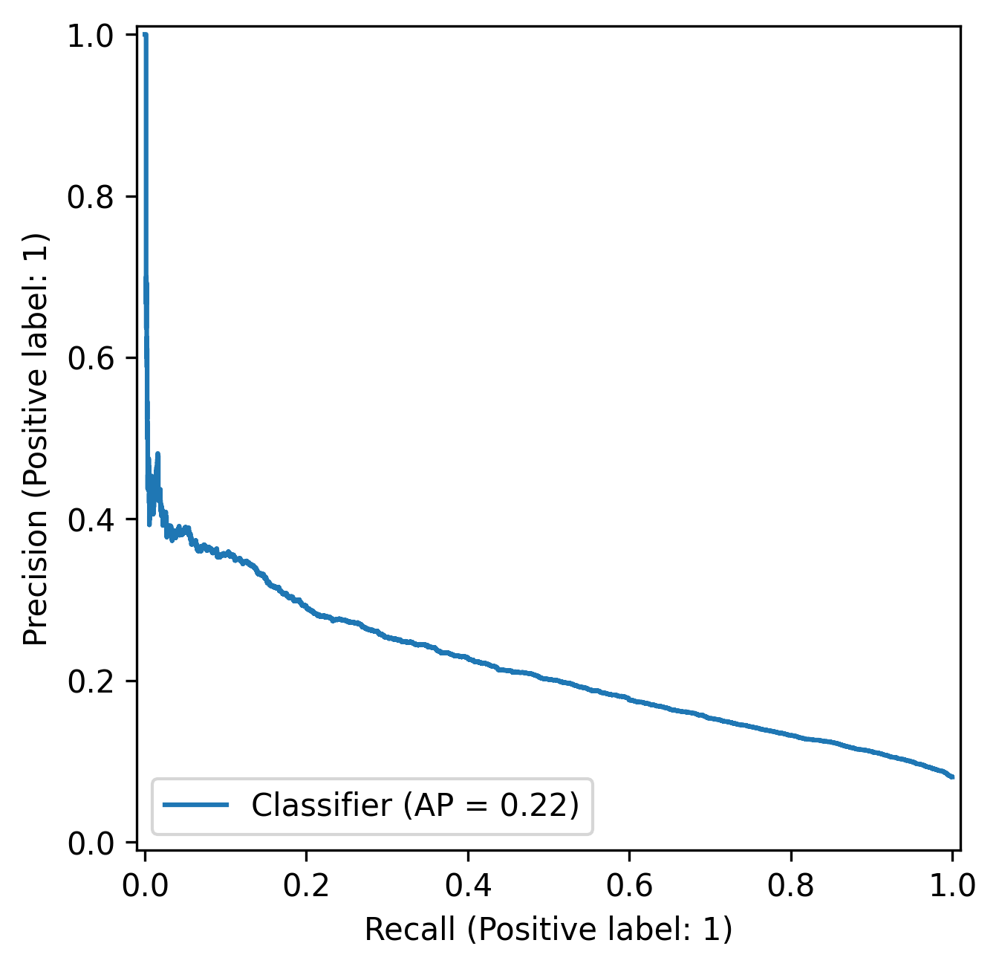
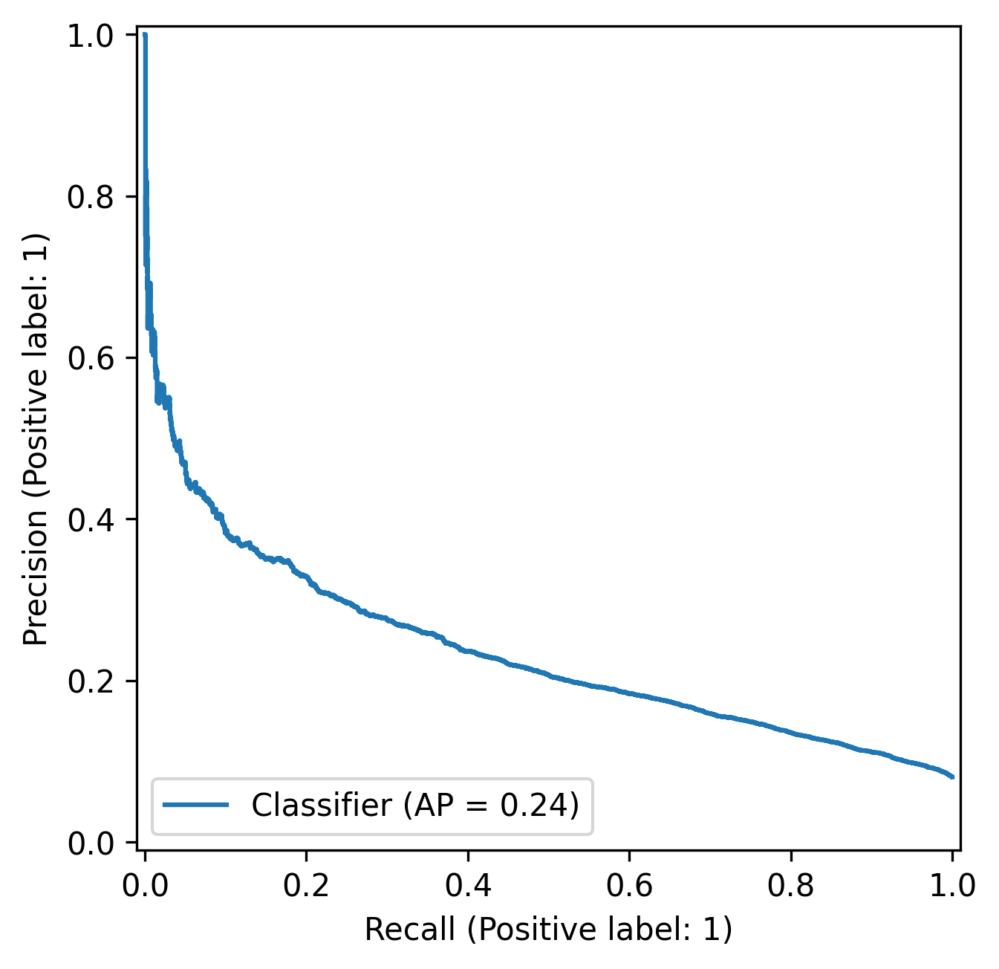
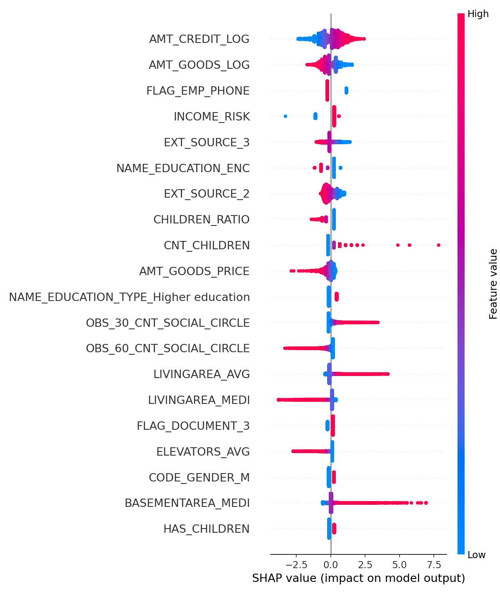
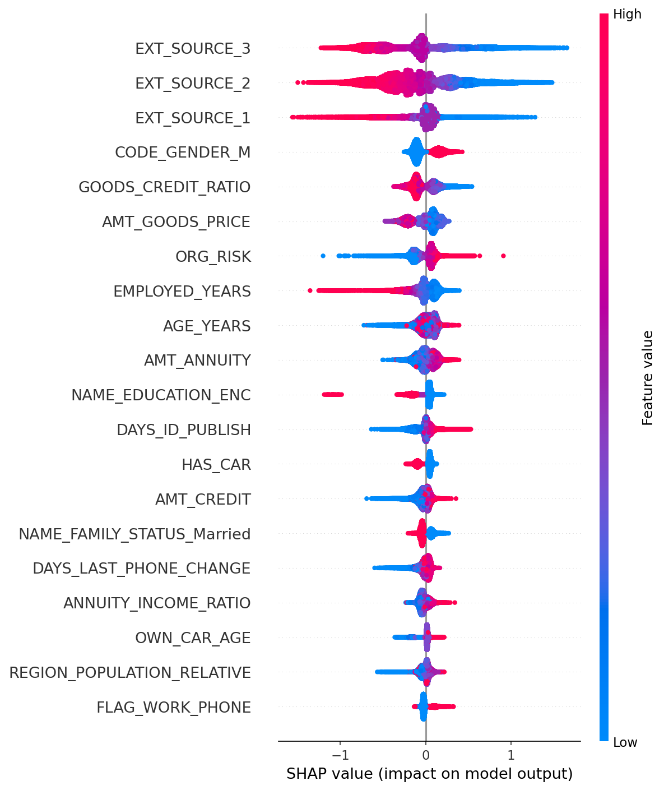

# Credit Risk Modeling with Probability Calibration, Risk Bucketing, and SHAP Explainability

## 🚀 Live Demo

👉 [Try the Credit Risk Predictor](https://credit-risk-default-predictor.streamlit.app/)

The application uses a deployed FastAPI inference service forgit predictions and SHAP explanations.

---

## Project Overview

This project demonstrates an end-to-end credit risk pipeline that moves beyond simple classification. It combines probability calibration, risk-based decisioning, model explainability, and a production-style Streamlit + FastAPI application architecture.

Rather than optimizing for accuracy alone, the project emphasizes **risk ranking, probability calibration, and explainability**, 
closely mirroring how credit risk models are used in real financial institutions.

---

## Key Highlights

- Calibration: Reduced XGBoost ECE from approximately 0.253 to 0.0026 on the held-out test set using Platt scaling, while slightly improving ROC-AUC from 0.760 to 0.763.
- Decisioning: Developed a 4-tier Risk Bucketing framework (Low to Very High) to automate lending decisions.
- Explanation layer supporting model transparency and auditability

---

## Dataset
- **Source:** [Home Credit Default Risk Dataset – Kaggle](https://www.kaggle.com/c/home-credit-default-risk)
- Raw dataset is not included in this repository due to size constraints.
- **Target:** `TARGET` (1 = default, 0 = non-default)
- **Data type:** Structured tabular data (numerical + categorical)
- **Challenges:**
  - Class imbalance
  - Missing values
  - High-cardinality categorical features
  - Regulatory need for explainability

### Note on src/ directory
The `src/` directory contains modular versions of the pipeline functions. 
Scripts are works in progress and the primary reproducible workflow 
is through the numbered notebooks in `notebooks/`.

---

## Application Architecture

The project consists of two components:

### Streamlit Application

Provides the user interface for entering applicant information
and displaying predictions and model explanations.

### FastAPI Inference API

Provides model inference, metadata, and SHAP explanation endpoints.

The Streamlit frontend communicates with the FastAPI backend
over HTTP.

### Deployment

- **Frontend:** Streamlit Community Cloud
- **Backend:** Render
- **API:** `https://credit-risk-api-312r.onrender.com`

### API Endpoints

The FastAPI service exposes:

| Endpoint | Purpose |
|----------|---------|
| `GET /health` | Service health check |
| `GET /metadata` | Provides categorical values used by the frontend |
| `POST /predict` | Returns default probability and risk decision |
| `POST /explain` | Returns SHAP-based model explanations |

### Request Flow

```text
Streamlit
    │
    ├── GET /metadata
    │
    ├── POST /predict
    │
    └── POST /explain
             │
             ▼
        FastAPI API
             │
       ┌─────┴─────┐
       │           │
  Prediction    SHAP
       │           │
       ▼           ▼
Calibrated     XGBoost
XGBoost         model
```

---

## Project Structure
```
credit-risk-ml/
│
├── data/
│ ├── raw/
│ └── processed/
│
├── notebooks/
│ ├── 01_eda.ipynb
│ ├── 02_feature_engineering.ipynb
│ ├── 03_modeling_baseline.ipynb
│ ├── 04_uncertainty_calibration.ipynb
│ ├── 05_business_decisions.ipynb
│ ├── 06_explainability_shap.ipynb
│ └── 07_xgb_modeling.ipynb
│
├── src/
│ ├── data_prep.py
│ ├── features.py
│ ├── train.py
│ ├── evaluate.py
│ ├── uncertainty.py
│ ├── train_xgb.py
│ └── explainability.py
│
├── utils/
│   └── shap_plot.py
│
├── models/
│ ├── logreg_baseline.joblib
│ ├── logreg_platt.joblib
│ ├── logreg_iso.joblib
│ ├── xgb_model.joblib
│ ├── xgb_calibrated.joblib
│ └── preprocessor_fit.joblib
│
├── reports/
│ └── figures/
| └── summary_tables
│
├── app.py
└── README.md
└── requirements.txt
```

---

## Modeling Approach

### Models
- Logistic Regression (baseline, class-weighted to handle imbalance)
- XGBoost (final model for improved non-linear learning and ranking performance)

### Evaluation Metrics
- ROC-AUC (risk ranking)
- Precision / Recall
- Expected Calibration Error (ECE)
- Brier Score

### Probability Calibration
- Applied **Platt** Scaling and **Isotonic** Regression to Logistic Regression to align predicted probabilities with observed default rates.
- Evaluated using reliability curves, Expected Calibration Error (ECE) and Brier Score
- Platt scaling and isotonic regression were evaluated on the validation set. XGBoost with Platt scaling provided the strongest combination of discrimination and probability calibration and was selected as the final model.
- Applied sigmoid calibration with 5-fold CV to XGBoost, which improved probability alignment (↓ ECE , ↓ Brier Score) without degrading AUC.

---

## Model Performance Summary

| Metric | Logistic Regression | Logistic Regression Calibrated (Isotonic) | XGBoost | XGBoost Calibrated (Platt) |
|--------|-------------------|--------------------|--------------------|--------------------|
| ROC-AUC | 0.746 | 0.750 | 0.760 | 0.763 |
| Brier Score | 0.204 | 0.068 | 0.149 | 0.067|
| ECE | 0.3410 | 0.0026 | 0.2528 | 0.0025|

XGBoost with Platt calibration was selected as the final model based on validation performance and subsequently evaluated once on the held-out test set.

### ROC Curve (Baseline)

### ROC Curve (XGBoost)


### Precision-Recall Curve (Baseline)

### Precision-Recall Curve (XGBoost)


---

## Business Logic: Risk Bucketing

Predictions are mapped to specific lending actions. This allows the business to automate low-risk loans while flagging high-risk cases for manual review.

| Risk Bucket | PD Range | Decision |
|------------|---------|----------|
| Low        | < 5%     | Auto-approve |
| Medium     | 5–16%    | Approve with conditions |
| High       | 16–45%   | Manual review |
| Very High  | >= 45%    | Reject |

---

## Business Decisions
The project illustrates how model outputs directly influence lending decisions and portfolio performance. It demonstrates:
- How approval thresholds determine portfolio risk exposure
- The trade-off between growth (approval rate) and credit losses (default rate)
- Why applicants with seemingly reasonable profiles may still fall below risk tolerance
- How explainability increases stakeholder trust in automated underwriting
- How model-driven decisions align with institutional risk appetite

---

## Explainability (SHAP)

### Global Feature Importance

#### Logistic Regression


#### XGBoost


SHAP (SHapley Additive exPlanations) is used to:
- Identify global drivers of default risk
- Explain individual applicant decisions
- Support transparency in regulated lending environments

Key outputs:
- Global feature importance (mean absolute SHAP)
- Individual applicant explanations
- Quantification of each feature’s contribution to the model score.
- Consistency between SHAP risk drivers and domain expectations
- Provide an auditable explanation layer for model transparency

### Individual Applicant Explanations

The FastAPI `/explain` endpoint generates applicant-level SHAP explanations
using the underlying XGBoost model. The final probability shown to users is
produced by the calibrated XGBoost model.

SHAP values indicate whether each feature pushes the model toward higher or
lower predicted risk. They are model-score contributions rather than
percentage-point changes in the final calibrated probability.

---

## Key Takeaways
- Calibration is critical when probabilities drive decisions
- Risk ranking matters more than raw accuracy
- Explainability is essential for regulated domains
- Business logic must be explicitly defined, not implied

---

## Future Improvements
- Monotonic constraints on XGBoost for regulatory compliance
- Cost-sensitive optimization
- Reject inference
- Temporal validation
- Policy stress testing

---

## Setup
```bash
pip install -r requirements.txt
```

---

## Author
Built as a portfolio project to demonstrate **end-to-end applied data science**, bridging modeling, uncertainty, and business decision-making.

